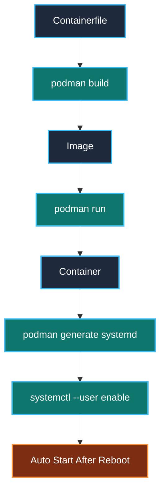
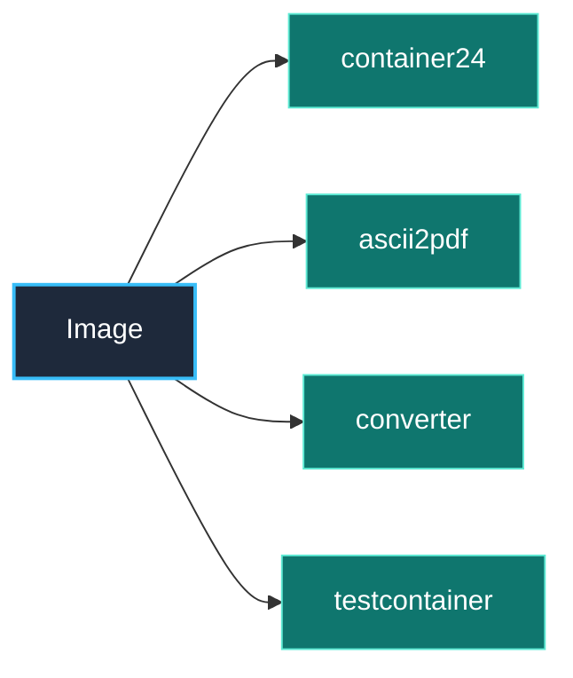
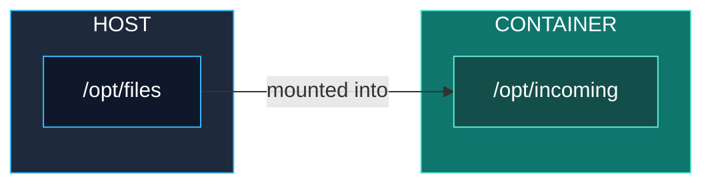
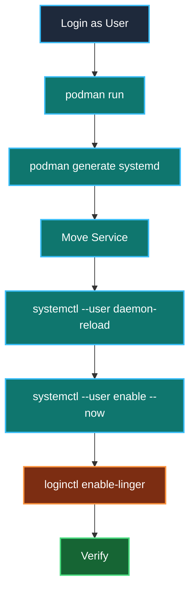

# RHCSA EX200 – Podman Container Cheat Sheet (1-Page Revision)

> **Goal:** Complete any EX200 rootless container question quickly by following the same workflow every time.

---

## 1. Container Lifecycle



---

## 2. Image vs Container

| Image                      | Container                  |
| -------------------------- | -------------------------- |
| Template                   | Running instance           |
| Read-only                  | Writable                   |
| Can create many containers | Created from one image     |
| Built using `podman build` | Created using `podman run` |

Example



---

## 3. Build an Image

### Standard filename

```text
Containerfile
```

Build

```bash
podman build -t IMAGE_NAME .
```

Example

```bash
podman build -t monitor .
```

---

### Custom filename

```bash
podman build -t IMAGE_NAME -f MYFILE .
```

Example

```bash
podman build -t monitor -f mycontainerfile .
```

---

## 4. Simplest Containerfile

```dockerfile
FROM registry.access.redhat.com/ubi9/ubi:latest

CMD ["sleep","infinity"]
```

Perfect for EX200 practice.

---

## 5. Run a Rootless Container

General syntax

```bash
podman run -d \
--name CONTAINER_NAME \
-v HOST_DIR:CONTAINER_DIR:Z \
IMAGE_NAME
```

Example

```bash
podman run -d \
--name container24 \
-v /opt/files:/opt/incoming:Z \
-v /opt/processed:/opt/outgoing:Z \
monitor
```

---

## 6. Remember Volume Mapping

```text
-v HOST:CONTAINER:Z
```

Example

```text
-v /opt/files:/opt/incoming:Z
```



Always

```text
LEFT  = HOST

RIGHT = CONTAINER
```

---

## 7. Why ":Z"

SELinux relabel.

Without `:Z`

```text
Permission denied
```

may occur.

---

## 8. Generate systemd Service

Create user directory

```bash
mkdir -p ~/.config/systemd/user
```

Generate service

```bash
podman generate systemd \
--name CONTAINER_NAME \
--files
```

Move service

```bash
mv container-CONTAINER_NAME.service \
~/.config/systemd/user/
```

---

## 9. Reload systemd

```bash
systemctl --user daemon-reload
```

---

## 10. Enable Service

```bash
systemctl --user enable --now \
container-CONTAINER_NAME.service
```

Verify

```bash
systemctl --user status \
container-CONTAINER_NAME.service
```

---

## 11. Enable Auto Start After Reboot

As **root**

```bash
loginctl enable-linger USERNAME
```

Example

```bash
loginctl enable-linger natasha
```

Verify

```bash
loginctl show-user natasha | grep Linger
```

Expected

```text
Linger=yes
```

---

## 12. Useful Commands

### Images

```bash
podman images
```

### Running Containers

```bash
podman ps
```

### All Containers

```bash
podman ps -a
```

### Logs

```bash
podman logs CONTAINER
```

### Enter Container

```bash
podman exec -it CONTAINER bash
```

### Remove Container

```bash
podman rm -f CONTAINER
```

### Remove Image

```bash
podman rmi IMAGE
```

---

## 13. Most Common EX200 Pattern

Almost every question changes only:

* User
* Image Name
* Container Name
* Host Directory
* Container Directory
* Service Name

The workflow never changes.



---

## 14. Last-Minute Exam Checklist ✅

* ☐ Login as the correct regular user.
* ☐ Use the correct image.
* ☐ Give the container the exact required name.
* ☐ Mount the correct host directories.
* ☐ Mount them to the correct container directories.
* ☐ Include `:Z` on bind mounts unless instructed otherwise.
* ☐ Generate the systemd service.
* ☐ Place the service in `~/.config/systemd/user/`.
* ☐ Run `systemctl --user daemon-reload`.
* ☐ Enable and start the service.
* ☐ Run `loginctl enable-linger USER` as root.
* ☐ Verify the service is **enabled** and **active**.
* ☐ Verify the container is running with `podman ps`.

---

## One Sentence to Remember

> **Build an Image once → Create many Containers → Generate a user systemd service → Enable it → Enable linger → Verify.**
